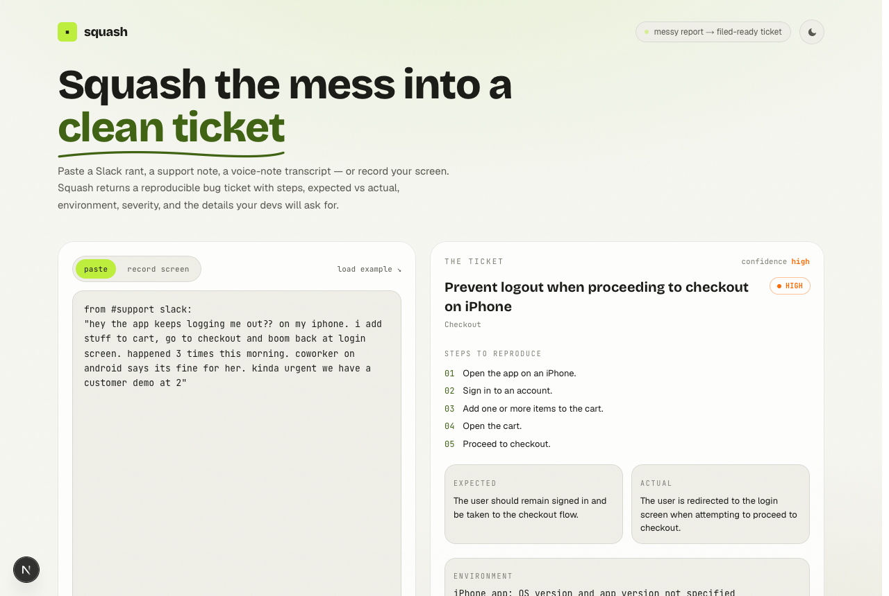

# Squash

**Turn a messy bug report into a clean, reproducible ticket.**

Paste a Slack rant, a support note, or a voice-note transcript, or record your screen reproducing the bug. Squash returns one filed-ready ticket: steps to reproduce, expected vs actual, environment, severity, confidence, and the details still missing before a developer can start.


## Demo

Watch the full walkthrough, including the paste flow and screen-recording to ticket, in the launch thread: [x.com/WoCStreet/status/2070126819601440788](https://x.com/WoCStreet/status/2070126819601440788)

## The problem

Every team loses hours on the same boring task: turning a vague bug complaint into something a developer can actually work. The hardest part, writing accurate steps to reproduce, is exactly the part people skip. So reports bounce back and forth, and bugs that "can't be reproduced" pile up.

Squash does that conversion in one step. Mess in, filed-ready ticket out. No template to learn.

## What it does

- **Reads any messy input.** A Slack thread, a support ticket, a transcript, or a screen recording of the bug happening.
- **Writes the steps to reproduce.** For recordings, it samples frames from the screen capture and a vision model derives the steps from what actually happened on screen.
- **Structures the ticket.** Title, steps, expected vs actual, environment, area, and a severity it judges from the impact.
- **Flags what is missing.** It calls out the details a developer will still ask for (build version, account id, network conditions) so the report does not bounce.
- **Exports in one click.** Copy as Markdown, or open a prefilled GitHub issue.

## How it works

The whole pipeline stays inside Next.js and Convex, with no separate media worker:

1. The browser captures the screen with `getDisplayMedia` and grabs a handful of downscaled frames via canvas. No ffmpeg needed.
2. Frames upload to Convex file storage; text inputs go straight to a mutation.
3. A Convex action calls the model (text for pasted reports, vision for frames) and patches the ticket.
4. Convex's reactive queries stream the ticket onto the screen as it is written, field by field.

## Tech stack

- **Next.js** (App Router) and **React**
- **Convex** for the database, file storage, scheduled actions, and realtime updates
- **GPT-5.4** for text structuring and vision based repro-step extraction
- **Motion** for the staggered reveals and the processing animation
- **Tailwind CSS** with a custom light and dark theme



## Run it locally

Prerequisites: Node 18+, a Convex account, and an OpenAI-compatible API key.

```bash
# 1. install
npm install

# 2. create a Convex dev deployment (writes NEXT_PUBLIC_CONVEX_URL to .env.local)
npx convex dev

# 3. set the model credentials on the Convex deployment
npx convex env set LLM_API_KEY <your-key>
npx convex env set LLM_BASE_URL https://api.openai.com/v1
npx convex env set LLM_MODEL gpt-5.4
npx convex env set LLM_VISION_MODEL gpt-5.4

# 4. run the app (keep convex dev running in another tab)
npm run dev
```

Open http://localhost:3000 and paste a bug report, or switch to the record tab.

Optional: set `NEXT_PUBLIC_GITHUB_REPO=owner/repo` in `.env.local` to enable the one-click "open GitHub issue" button.

## License

MIT
